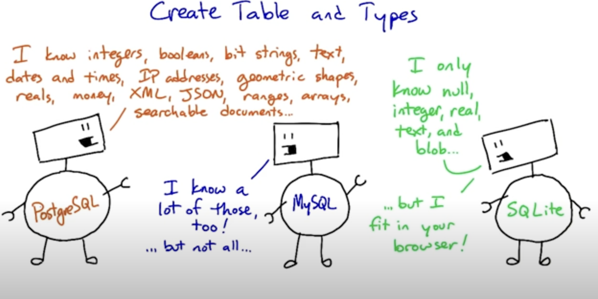

# 3 pieces together

entities, attributes, and relationships form the foundation of data modeling, which is creating a conceptual, logical, or physical representation of data for a particular purpose or context.

## Entity

In data modeling, an entity is a real-world object or concept that can be uniquely identified and described, such as a person, place, thing, event, or concept. An entity is typically represented by a table in a relational database, and each instance of the entity is represented by a row in the table.

## Attribute

An attribute is a characteristic or property of an entity, such as a name, age, address, or color. Attributes are represented by columns in the table that represents the entity.

## Relationship

A relationship is a connection or association between two or more entities.
3 types of relationship
one-to-one,
one-to-many,
many-to-many

## Types of Data Modeling

## Data normalization

Data normalization can be defined as a process designed to facilitate a more cohesive form of data entry, essentially ‘cleaning’ the data. When you normalize a data set, you are reorganizing it to remove any unstructured or redundant data to enable a superior, more logical means of storing that data.

Rules for normalized tables:

1. Every row has the same number of columns.
   In practice, the database system won't let us literally have different numbers of columns in different rows. But if we have columns that are sometimes empty (null) and sometimes not, or if we stuff multiple values into a single field, we're bending this rule.

The example to keep in mind here is the diet table from the zoo database. Instead of trying to stuff multiple foods for a species into a single row about that species, we separate them out. This makes it much easier to do aggregations and comparisons.

2. There is a unique key and everything in a row says something about the key.
   The key may be one column or more than one. It may even be the whole row, as in the diet table. But we don't have duplicate rows in a table.

More importantly, if we are storing non-unique facts — such as people's names — we distinguish them using a unique identifier such as a serial number. This makes sure that we don't combine two people's grades or parking tickets just because they have the same name.

3. Facts that don't relate to the key belong in different tables.
   The example here was the items table, which had items, their locations, and the location's street addresses in it. The address isn't a fact about the item; it's a fact about the location. Moving it to a separate table saves space and reduces ambiguity, and we can always reconstitute the original table using a join.

4. Tables shouldn't imply relationships that don't exist.
   The example here was the job_skills table, where a single row listed one of a person's technology skills (like 'Linux') and one of their language skills (like 'French'). This made it look like their Linux knowledge was specific to French, or vice versa ... when that isn't the case in the real world. Normalizing this involved splitting the tech skills and job skills into separate tables.

https://www.splunk.com/en_us/blog/learn/data-normalization.html

## Data denormalization

denormalization as an approach to making database queries faster by avoiding joins. This is an advanced topic beyond the scope of this course. But if you're interested in it, on modern database systems (such as PostgreSQL) it is often possible to meet the same goals using tools such as indexes(opens in a new tab) and materialized views(opens in a new tab).

## subqueries

https://www.postgresql.org/docs/9.4/sql-select.html#SQL-FROM

## views
