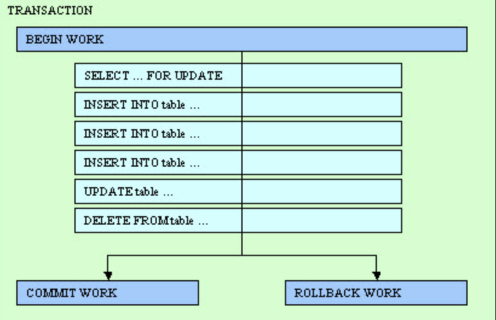

# how database processes operations - transaction

A database transaction delimits a set of database operations (i.e. SQL statements), that are processed as a whole.

Database operations included inside a transaction are validated or canceled as a unique operation.

A database needs to have :

- integrity
- consistency
- scalability
- flexibility
- performance

## summary

The database server is in charge of data concurrency and data consistency. Data concurrency allows the simultaneous access of the same data by many users, while data consistency gives each user a consistent view of the database.

Without adequate concurrency and consistency control, data can be changed improperly, compromising integrity of your database. If you want to write applications that can work with different kinds of database servers, you must adapt the program logic to the behavior of the database servers, regarding concurrency and consistency management. This requires good knowledge of multiuser database application programming, transactions, locking mechanisms, isolation levels and wait mode. If you are not familiar with these concepts, carefully read the documentation of each database server that covers this subject.

## some mechanisms

### locking

locking mechanisms are a way for databases to produce sequential data output without the sequential steps. The locks provide a method for securing the data that is being used so no anomalies can occur like lost data or additional data that can be added because of the loss of a transaction.

#### shared lock

Shared locks let you read the row or the table that is being locked. Hence, it’s also called a read lock. Multiple transactions (you can think of each transaction as a separate process) can acquire a shared lock on the same resource and read from it. No transaction is allowed to update the resource while it has a shared lock.

#### exclusive lock

Exclusive locks lock the row or table entirely and let the transaction update the row in isolation. Unlike shared locks, only one transaction can acquire an exclusive lock on a certain resource at one point in time. And while it acquires the lock on that resource, other processes that want to acquire the lock on the same resource will have to wait. Once the lock is released, the remaining processes can acquire it and make modifications.

### transactions

Main property, they need to be ACID...

TBC

### isolation

TBC

### wait mode

TBC

ressources:

https://medium.com/inspiredbrilliance/what-are-database-locks-1aff9117c290
