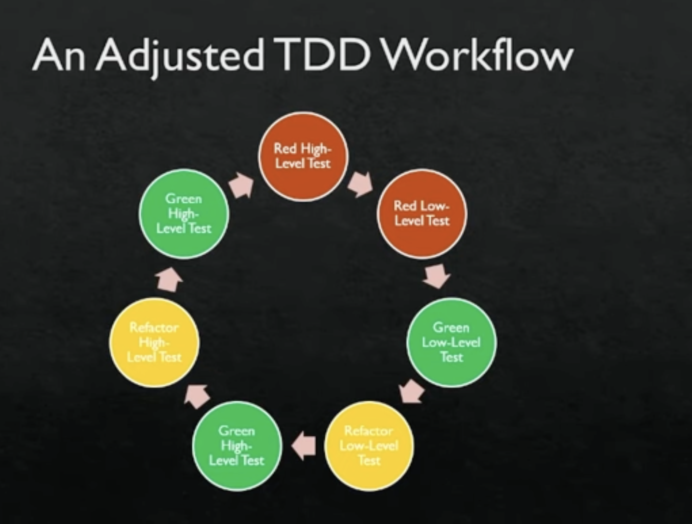

# basic definition

- contract first
- Tests first then implementation
- Red Green Refactor

# Common misunderstoods

- mock everything
- single method tests only

# what is good

- improve the design of the method contracts
- improve understanding of codebase
- document code in tests

# what is bad

## Good tests

-> Test the what not the how
-> they Are not tied to a specific implementation, -> they assert on the outcomes of a function
-> Do not require huge amounts of state to function
-> Are clear and legible, requiring a minimum amount of “head compilation
-> Only test one thing
-> Only assert on the dimensions of one thing

https://youtu.be/Jv2uxzhPFl4?si=NYHp07QnLwmtipLp
https://www.youtube.com/watch?v=D7LKslgwxmQ
