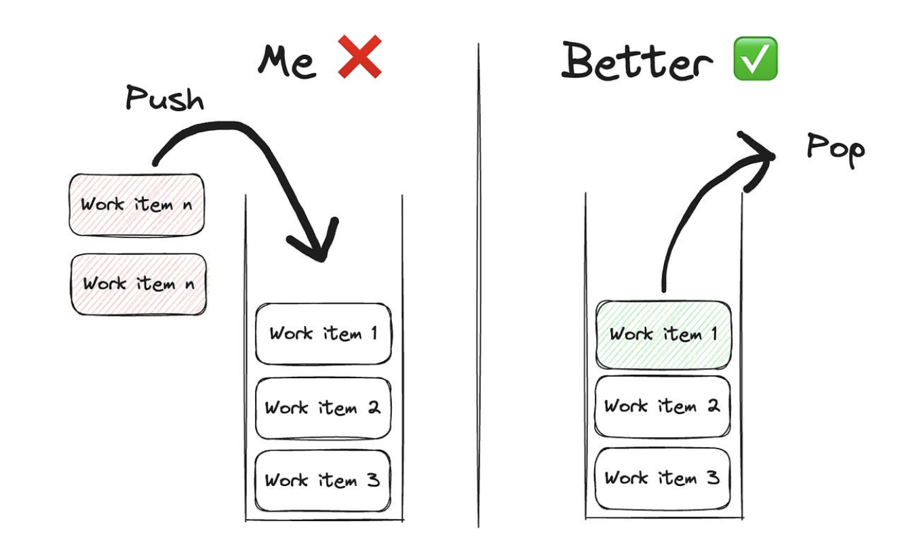

# blameless culture benefits

When people are hesitant to share their opinions, you miss out on so many creative solutions!
If people are hesitant to do that → what mostly happens is that one person says that this is the way to go and everyone agrees to it. This might not provide the best solution at the end and can cause so many long-term issues.

**Psychological safety** -> _Great & healthy team discussions_ -> _great results!_

You can read more about how important opinions are here: The importance of forming opinions in the engineering industry.

_Blameless retrospectives are the best way to learn from mistakes as an engineering team_.

# some lessons learned

Lesson 1: Bring solutions, not problems. Focus on showing how you are there to support the team that needs the help, even if only as an advisor.

Lesson 2: Clean code isn’t the end goal. Collaborating effectively with your team is more important than ensuring every line of code is as clean as possible.

Lesson 3: Team outcomes > individual outcomes. What you spend your time on should be directly correlated with what will bring the highest impact for the team.

Lesson 4: Adapt to your manager. Every manager will be different. Understand how to adapt to your manager’s style and goals to see the best collective outcomes.

Lesson 5: Influence isn’t about wording. Focus on building relationships with a foundation of trust. That’s way more important than how you word your request.

