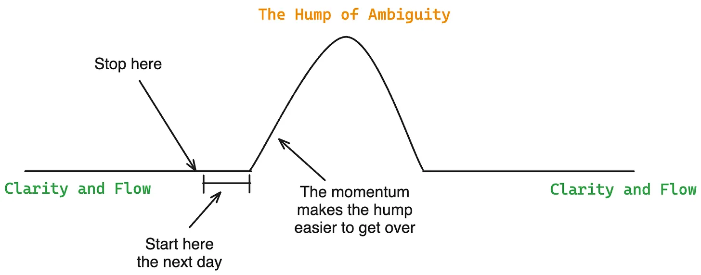

# 1.Leave work slightly unfinished for easier flow the next day

    Stop right before a “sticking point.” A sticking point is a task that’s part of a project where I know the steps to do to complete it, but I don’t know if there are hidden costs.

    For example, if my sticking point is deploying my ML model and HTTP server to a dev instance and verifying that it processes requests properly, then the hidden costs are deployment errors, authentication errors, resource constraints, etc.

    Write down the next steps extremely clearly. Writing down steps makes regaining context and the state of mind from the day before easier.
        Make them actionable and unambiguous.

